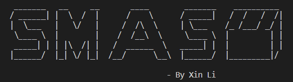

# SMSA-Toolkit v1

  

 

  <AMGD Toolkit>

The security of metaverse games needs more attentionThe security of metaverse games needs more attention

Honors Theses - UA Campus Repository · Dec 1, 2022Honors Theses - UA Campus Repository · Dec 1, 2022

Technological advancements in immersive technologies, such as virtual reality (VR) and augmented reality (AR), have driven the development and adoption of the metaverse. The metaverse is a virtual world that is parallel to the real world. Many industries, including healthcare and gaming, have incorporated metaverse in their services, leading to an immersive virtual experience for users. Meanwhile, the metaverse has also brought some threats to people. This report presents a comprehensive discussion on the various security issues that users may face in the metaverse and takes Roblox as an example to analyze first whether people pay attention to the security of metaverse games. Second, people's sentiments about metaverse games. The result has shown that the public like Metaverse games but pays little attention to the security issues of metaverse games.

## Use cases

·Sensing Analysis:Conduct software and give social media sensing analysis for software security concern results.

·Enhancing the framework: Enhance SMSASSC toolkit through the incorporation of additionally scripts from third-party sources.

## Proposed Framework

  

·There are two code sections. The name scraper.py is the crawler code, and the sentiment_analysis is the sentiment analysis code. The crawler chooses a variety of crawler
tools, including selenium, requests, regex, newspaper, and various APIs. The crawler uses multi-threaded crawling.

·Sentiment analysis consists of three parts: data preprocessing, word frequency analysis displayed in a pie chart, word cloud, and a classifier based on the Decision 
Tree-VAUDER- Machine Learning Model. The main packages used are Pandas, Matplotlib, Nltk, Wordcloud, and Numpy. 

·The data produced by the crawler program includes the review title articles crawled from 6 data sources according to the selected keyword combination. The data sources are Youtube, Facebook, Twitter, Google News, RSS feeds, Stack over flowand, Reddit and relate Formus 

·The data produced by the sentiment analysis program is summarized by the software, each software has a word cloud, a pie chart, the total sentiment analysis index of 
game reviews, and the top ten reviews by score (.csv).
 

